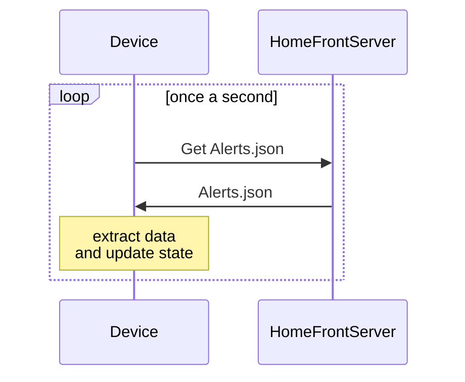
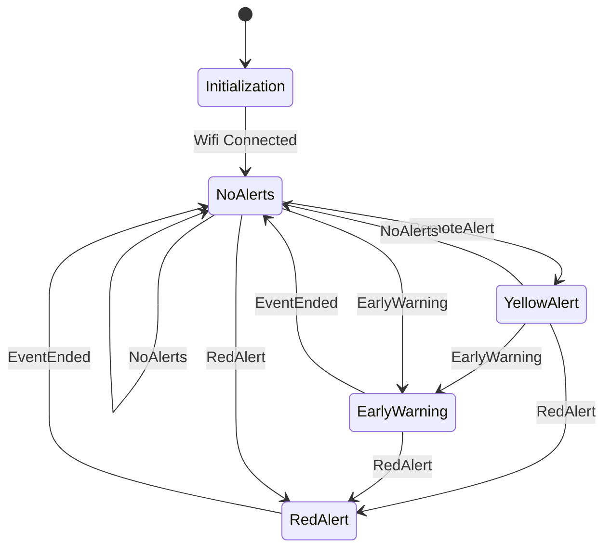
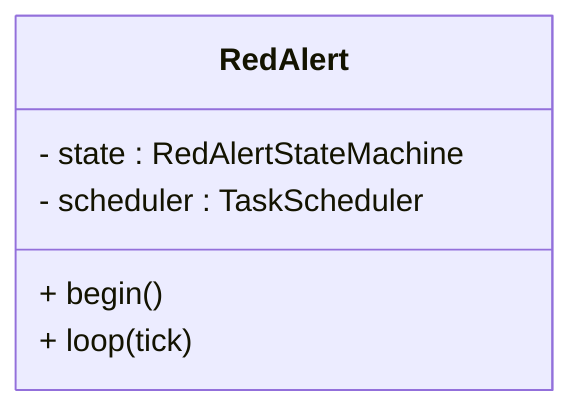
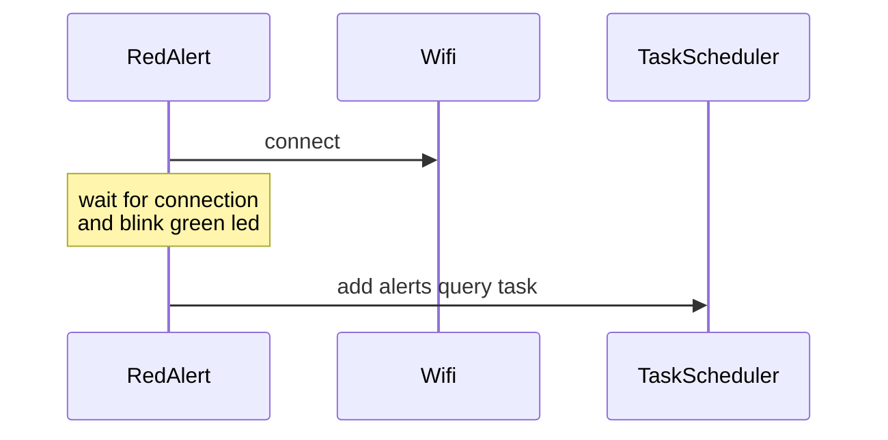

# Red Alert 32

ESP32 based red alert monitor.

## Idea

Monitor server of Home Front for alerts and indicate different states based on received messages.

## States

* No alerts (green LED)
* Alerts in other regions (yellow LED)
* Early notification (red LED)
* Red alert (red LED is blinking)
* Error (Yellow LED is blinking)

Special behavior is intended for RED alert state: RED alert state is removed only after notification
of finished event is received.

## Generic Flow

## State Machine

Event types:
 * `NoAlerts` - `Alerts.json` is empty
 * `RemoteAlert` - `Alerts.json` is not empty but doesn't have information about the specified region
 * `EarlyWarning` - `Alerts.json` contains early warning notification in specified region
 * `RedAlert` - `Alerts.json` contains Red Alert notification in specified region
 * `EventEnded` - `Alerts.json` contains Event Finished notification
 * `Error` - `Alerts.json` can't be read

## Classes

## Sequences

### Initialization

